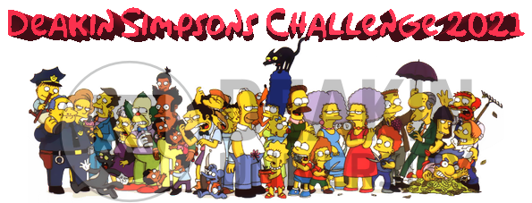

# Welcome to the Deakin Simpsons Challenge 2020

The aim of the Deakin Simpsons challenge 2020 is to detect simpson characters individually from pictures using a machine learning model. Specifically, your goal is to detect the following characters:

1. [Abraham grampa simpson](https://en.wikipedia.org/wiki/Grampa_Simpson)
2. [Apu nahasapeemapetilon](https://en.wikipedia.org/wiki/Apu_Nahasapeemapetilon)
3. [Bart simpson](https://en.wikipedia.org/wiki/Bart_Simpson)
4. [Charles montgomery burns](https://en.wikipedia.org/wiki/Mr._Burns)
5. [chief wiggum](https://en.wikipedia.org/wiki/Chief_Wiggum)
6. [Comic book guy](https://en.wikipedia.org/wiki/Comic_Book_Guy)
7. [Edna krabappel](https://en.wikipedia.org/wiki/Edna_Krabappel)
8. [Homer simpson](https://en.wikipedia.org/wiki/Homer_Simpson)
9. [Kent brockman](https://en.wikipedia.org/wiki/Kent_Brockman)
10. [Krusty the clown](https://en.wikipedia.org/wiki/Krusty_the_Clown)
11. [Lenny leonard](https://simpsons.fandom.com/wiki/Lenny_Leonard)
12. [Lisa simpson](https://en.wikipedia.org/wiki/Lisa_Simpson)
13. [Marge simpson](https://en.wikipedia.org/wiki/Marge_Simpson)
14. [Mayor quimby](https://en.wikipedia.org/wiki/Mayor_Quimby)
15. [Milhouse van houten](https://en.wikipedia.org/wiki/Milhouse_Van_Houten)
16. [Moe szyslak](https://en.wikipedia.org/wiki/Moe_Szyslak)
17. [Ned flanders](https://en.wikipedia.org/wiki/Ned_Flanders)
18. [Nelson muntz](https://en.wikipedia.org/wiki/Nelson_Muntz)
19. [Principal skinner](https://en.wikipedia.org/wiki/Principal_Skinner)
20. [Sideshow bob](https://en.wikipedia.org/wiki/Sideshow_Bob)

To achieve this task, you will be given a data set that consists of 19,548 to train your model and tune your hyperparameters. However, feel free to extend it by collecting new images or by using data augmentation.

Once you have built your model, you will have to submit it on the [CodaLab](https://competitions.codalab.org/competitions/27191?secret_key=f0a7cc3e-7f78-4bb1-8564-95bc2fadafa5) platform to be evaluated. 
We evaluate the performance of your model using the [Accuracy](https://scikit-learn.org/stable/modules/generated/sklearn.metrics.accuracy_score.html)  on a private test set that we have directly collected and labeled from TV show episodes.
Once the evaluation completed, your entry will appear on the leaderboard to see your performance against other competitors.

In the following, we will take you through  a 6-step process to build a simple model to perform this task as follows:

1. `Setup the environment:` Thie first step consists of setting the environement and downloading the data.
2. `Preprocessing:` The second step is a preprocessing step that consists of resizing, plitting, and piping the input data.
3. `Exploring the data:` The third step consists of a simple data exploration step where you will see samples of the data and some statistics to help you in understanding the data.
4. `Designing the model:` The forth step consists of designing an architecture for the task.
5. `Traning:` The fifth step consists of starting the training process.
6. `Monitoring:` The sixth step consists of monitoring the traning process to investigate possible overfitting.
7. `Submission:` The seventh and last step will take you through the submission process.

# Do you want to try?

Please fork this repository. Then, click here to open the Notebook in Google Colab . 

Just follow the instructions!

# References

- [The Simpsons characters recognition and detection using Keras](https://medium.com/alex-attia-blog/the-simpsons-character-recognition-using-keras-d8e1796eae36)

# Acknowledgment

**Mohamed Reda Bouadjenek**

**Lecturer of Applied Artificial Intelligence**

**School of Information Technology, Faculty of Sci Eng & Built Env**

**Deakin University**

**Locked Bag 20000, Geelong, VIC 3220**

**reda.bouadjenek@deakin.edu.au**

**www.deakin.edu.au**
